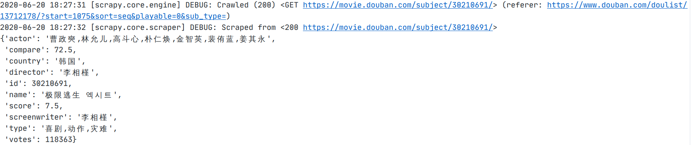
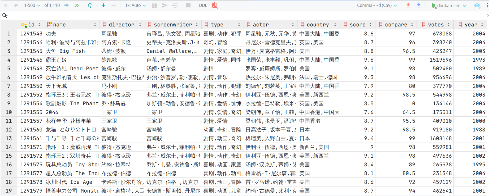
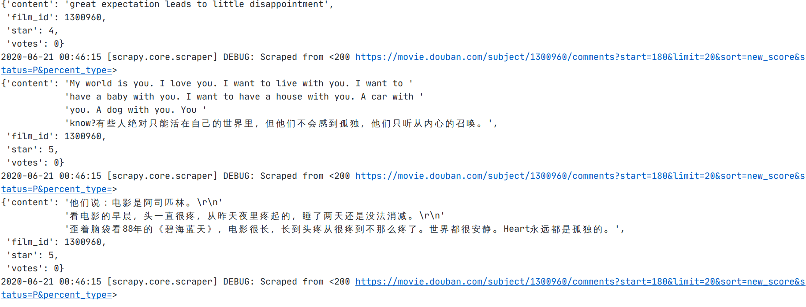
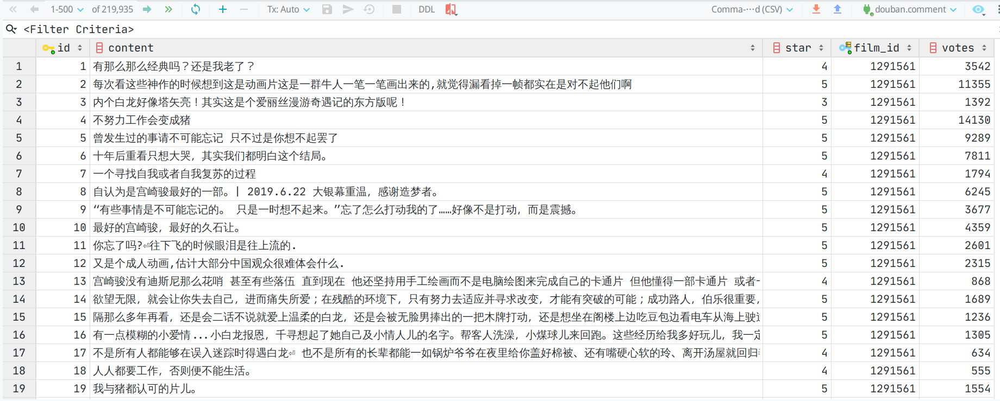

# douban_crawler

爬取指定豆列中的的电影信息及其短评

## 功能

默认爬取豆列《评价人数超过十万的电影》( https://www.douban.com/doulist/13712178/ )，一共包含1117部热门电影。

## 爬取字段说明

### 电影信息

电影信息的`class`定义如下：

```python
class FilmItem(scrapy.Item):
    id = scrapy.Field()  # 豆瓣id
    name = scrapy.Field()  # 电影名
    director = scrapy.Field()  # 导演
    screenwriter = scrapy.Field()  # 剧本
    type = scrapy.Field()  # 电影类型
    actor = scrapy.Field()  # 主演
    country = scrapy.Field()  # 制片国家/地区
    score = scrapy.Field()  # 评分
    votes = scrapy.Field()  # 评论人数
    year = scrapy.Field()  # 上映时间
    compare = scrapy.Field()  # 与同类电影对比
```

爬取的单条电影信息为如下格式：

```json
{'actor': '徐峥,王传君,周一围,谭卓,章宇,杨新鸣,王佳佳,王砚辉,贾晨飞,龚蓓苾',
 'compare': 97.5,
 'country': '中国大陆',
 'director': '文牧野',
 'id': 26752088,
 'name': '我不是药神',
 'score': 9.0,
 'screenwriter': '韩家女,钟伟,文牧野',
 'type': '剧情,喜剧',
 'votes': 1516141,
 'year': 2018}
```

### 电影短评

短评的`class`定义如下：

```python
class CommentItem(scrapy.Item):
    content = scrapy.Field()  # 评论
    star = scrapy.Field()  # 评分
    votes = scrapy.Field()  # 有用
    film_id = scrapy.Field()  # 电影id
```

爬取的单条短评为如下格式：

```json
{'content': '斯皮尔伯格把他对电影的梦想、热心、爱与情怀，浓缩到这部片子，通过极具年代感的经典电影和角色，又并茂高科技的现代游戏闯关，他拿手的、专注的、想诉说的都在这里给影迷情倾盆呈现，并在最后一句“谢谢你玩我的游戏”推向高潮，就像在银幕前看着他对我们说“谢谢你看我的电影”…泪奔',
 'film_id': 4920389,
 'star': '力荐',
 'votes': 11779}
```

## 使用方法

首先导入`douban`数据库：

```bash
mysql -uroot -p douban < douban.sql
```

接下来使用`pip`安装依赖库（`Scrapy`和`PyMySQL`）：

```bash
pip install -r requirements.txt
```

此外还需要在`doudan_crawler/settings.py`中修改数据库相关配置：

```python
# database configurations
MYSQL_HOST = 'localhost'
MYSQL_DBNAME = 'douban'
MYSQL_USER = 'username'  # username
MYSQL_PASSWD = 'password'  # password
```

**若想要爬取其他豆列，同样在`settings.py`中，修改`start_urls`即可：**

```python
# doulist url
start_urls = ['https://www.douban.com/doulist/13712178/',]
```

然后就可以开始爬取工作。

**首先爬取电影详情：**

```bash
scrapy crawl film
```

爬取过程中会终端输出如下内容：



20分钟就能完成爬取，数据库中能查看到如下数据：



**接下来爬取电影短评：**

```bash
scrapy crawl comment
```

爬取过程中终端会输出如下内容：



这一步耗时较长，需要2小时左右才能完成爬取，爬取完成后数据库内容如下：

